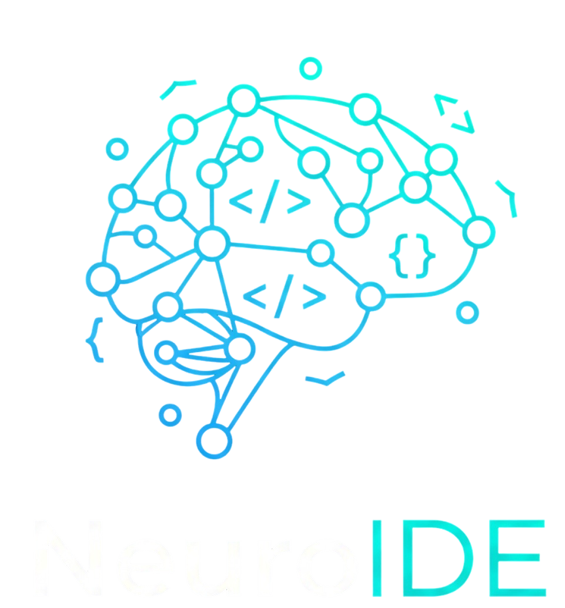

# NeuroIDE - Code With Intelligence



NeuroIDE is a powerful, browser-based integrated development environment (IDE) that combines modern web technologies with AI-assisted coding capabilities. Built with Next.js and powered by WebContainer API, it allows developers to create, edit, and run full-stack applications directly in the browser without any local setup.

## ✨ Features

### 🚀 **Browser-Based Development**
- **No Local Setup Required**: Code and run applications entirely in the browser
- **WebContainer Integration**: Full Node.js runtime environment in the browser
- **Live Preview**: Real-time preview with hot reloading
- **Terminal Access**: Full terminal emulator with command execution

### 🤖 **AI-Powered Coding**
- **Smart Code Suggestions**: Context-aware AI code completions powered by Ollama
- **AI Chat Assistant**: Get help and explanations from AI
- **Intelligent Code Analysis**: AI understands your project structure and context
- **Local AI Processing**: Powered by Ollama with CodeLlama for fast, private AI assistance

### 📁 **Rich Template Collection**
- **30+ Starter Templates**: React, Vue, Angular, Next.js, Express, Hono, and more
- **Multiple Categories**: Frontend, Backend, and Full-stack templates
- **Pre-configured Projects**: Ready-to-use project setups with dependencies

### 💻 **Professional IDE Experience**
- **Monaco Editor**: Full VS Code editing experience with syntax highlighting
- **Multi-file Support**: Tabbed interface with multiple open files
- **File Management**: Create, delete, rename files and folders
- **Auto-save**: Real-time saving with unsaved changes indicators

### 🔐 **User Management**
- **OAuth Authentication**: Sign in with GitHub or Google
- **Project Management**: Save, organize, and manage multiple playgrounds
- **Starring System**: Mark favorite projects
- **User Roles**: Support for different user permission levels

## 🛠️ Tech Stack

- **Frontend**: Next.js 15, React 19, TypeScript
- **Styling**: Tailwind CSS v4, Radix UI Components
- **Database**: MongoDB with Prisma ORM
- **Authentication**: NextAuth.js v5
- **Code Editor**: Monaco Editor (VS Code's editor)
- **Runtime**: WebContainer API for browser-based Node.js
- **AI Integration**: Ollama with CodeLlama for local, private AI assistance
- **State Management**: Zustand
- **Terminal**: XTerm.js


## 🚀 Quick Start

### Prerequisites
- **Ollama Installation**: Install Ollama from [ollama.ai](https://ollama.ai)
- **CodeLlama Model**: Pull the CodeLlama model: `ollama pull codellama:latest`
- **Start Ollama Server**: Run `ollama serve` to start the local AI server

### Creating a New Project
1. Sign in with GitHub or Google
2. Click "Add New" on the dashboard
3. Select a template from the available options
4. Give your project a name and description
5. Start coding immediately in the browser

### Using the Code Editor
- **File Explorer**: Navigate and manage files in the sidebar
- **Multi-tab Editing**: Open multiple files simultaneously
- **AI Suggestions**: Enable AI assistance for smart code completions
- **Live Preview**: See your changes in real-time
- **Terminal**: Run commands and manage dependencies

### AI Features
- **Toggle AI**: Enable/disable AI suggestions in the editor
- **Chat Assistant**: Ask questions and get coding help
- **Context Awareness**: AI understands your current file and project
- **Local Processing**: Powered by Ollama with CodeLlama for private, fast suggestions
- **Smart Code Completion**: Context-aware code suggestions based on your project structure
- **Offline Capable**: Works with local Ollama server for complete privacy

## 🏗️ Project Structure

```
neuroide/
├── app/                    # Next.js app router
│   ├── (auth)/            # Authentication pages
│   ├── (root)/            # Public pages (home)
│   ├── dashboard/         # User dashboard
│   ├── playground/[id]/   # Code playground editor
│   └── api/               # API routes
├── features/              # Feature-based architecture
│   ├── ai/               # AI suggestions and chat
│   ├── auth/             # Authentication logic
│   ├── dashboard/        # Dashboard components
│   ├── playground/       # Code editor functionality
│   └── webContainers/    # WebContainer integration
├── components/ui/         # Reusable UI components
├── neuroIDEStarters/     # Template collection (30+ templates)
└── lib/                  # Utilities and database
```

## 🎨 Available Templates

### Frontend
- React, Vue.js, Angular, Svelte
- Next.js, Nuxt, SvelteKit
- Astro, Vite + React/TypeScript

### Backend
- Express.js, Hono, Koa
- Node.js, GraphQL
- JSON Server, JSON GraphQL Server

### Full-stack
- Next.js with Tailwind CSS
- Vue.js with Quasar
- SvelteKit


---

**NeuroIDE** - Empowering developers with intelligent, browser-based coding experiences. 🚀
